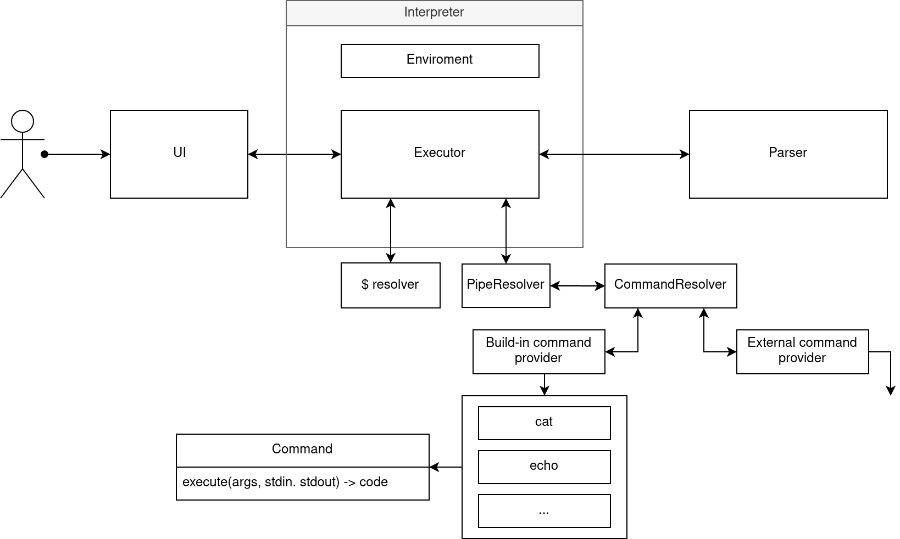

# Архитектура

## Общая структура системы
    

## Компоненты

### Работа системы и UI
    
При запуске программы, запускается бесконечный цикл, в котором происходит следующее:
1. В консоль выводится приглашение (prompt);
2. Ожидается ввод пользователем команды;
3. Введенная строка передается в интерпретатор;
4. Происходит работа интерпретатора;
5. В зависимости от результата работы интерпретатора выводится результат, ошибка или происходит выход из программы.

Если в качестве аргумента передается путь к скрипту, запускается аналогичный цикл, в котором вместо пунктов 1 и 2 в интерпретатор передаются строки из этого скрипт.
    
### Парсер

Представляет собой конечный автомат. Строит абстрактное синтаксическое дерево (AST). В отсутствие ветвления это дерево будет представлять собой бамбук, т.е. список операций, которые нужно выполнить по очереди Р.аспознает специальные символы `$`, `'`, `"`, `|`, `=`. В результате работы возвращает структуру глобально 3х различных типов:

+ Структура, которая предписывает интерпретатору осуществить подстановку (потенциально выполнить команду под `$`). Затем передать команду на перепарсинг.
+ Структура, которая предписывает интерпретатору положить в окружение новую переменную
+ Структура, которая предписывает интерпретатору выполнить комманду или набор команд.

### Интерпретатор

Интерпретатор принимает AST, перебирает содержащиеся в нем структуры и исходя из их предписаний вызвает соответствующий `Resolver`, принимает в ответ результат и передает его в UI.

### Окружение

Окружение - это словарь переменная-значение. При запуске приложения пустое окружение инициализируется и заполняется. При выходе из сессии окружение удаляется.

### Команды
За исполнение команд отвечает` CommandResolver`. Ему известен некоторый набор стандартных команд.
Если переданной команды нет в наборе, то она исполняется как вызов внешней программы по её адресу в системе.    

### Подстановки

Подстановка ($) - это такая команда, которая принимает в качестве аргументов строчку, позиции начал и концов подстрок, которые нужно заменить, и строки,  которые нужно подставить.

После подстановки подстрок снова вызывается парсер, и весь процесс начинается заново. Чтобы обеспечить единственность подстановки, подставляемая подстрока оборачивается в кавычки.

### Пайпы

Пайп - это такая команда, которая принимает две команды в качестве аргументов, выполняет первую из них, и её вывод передает во вторую. Если первая команда закончится ошибкой, вторая команда просто передаст ее дальше.

### Ошибки

Если ошибка происходит при работе парсера над командой, то программа об этом сообщит, в остальных случаях выводится стандартный поток ошибок. 
    
