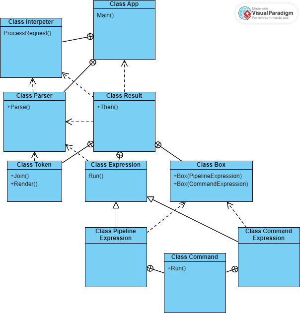

# Архитектура

## Схема системы
    

## Краткое описание работы программы
При запуске программы, запускается бесконечный цикл, в котором происходит следующее:
1. В консоль выводится приглашение (prompt);
2. Ожидается ввод пользователем команды;
3. Введенная строка передается в интерпретатор;
4. Происходит работа интерпретатора;
5. В зависимости от результата работы интерпретатора выводится результат, ошибка или происходит выход из программы.

Если в качестве аргумента передается путь к файлу, запускается аналогичный цикл, в котором вместо пунктов 1 и 2 в интерпретатор передаются строки из этого файла.

Для обретения более глубокого понимания работы программы достаточно ознакомиться с [компонентами системы](Архитектура.md#Компонентысистемы).

## Компоненты системы

##### Пояснение к разделу компоненты системы
Далее, каждый заголовок - класс в программе. Перечислены не все, а только основные классы. Иногда в скобках возле заголовка указаны упрощенные названия или проектные синонимы. Компоненты логически разбиты на подразделы, исходя из связности классов.  

### 1) App
Класс приложения. Основной класс, управляет `UI`, `Interpreter`.
Инициализирует `UI` и `Interpreter` и запускает цикл, в котором `UI` считывает команду
и передает ее интерпретатору. Выход из цикла (и приложения) происходит когда обработка введенной пользователем команды завершается ошибкой (`Status.Error`) или сигналом выхода (`Status.Exit`).

#### 1.1) UI

Класс `UI` отвечает за взаимодействие с пользователем: вывод приветствия (prompt) и считывание команды.

Чтение команды происходит с допущением многострочной команды, для этого при считывании команды хранятся следующие состояния:
+ `Normal`, если ввод завершен
+ `Backslash`, если в конце команды был обратный слеш, который соответствует переносу строки;
+ `SingleQuote`, если в команде присутствует незакрытая одинарная кавычка
+ `DoubleQuote`, если в команде присутствует незакрытая двойная кавычка.

В случае, если считалась некорректная строка, UI сразу выдаст сообщение об ошибке.

### 2) Interpreter (Интерпретатор)

Интерпретатор инициализирует парсер (`ShellParser`),  окружение (`ShellEnvironment`). 

Работа интерпетатора:
1. Принимает пользовательский ввод, передает его в парсер, после отработки которого извлекает их него результат-выражение (`Result<Expression>`)
2. Из результата-выражения интерпретатор конструирует результат-коробку (`Result<Box>`) - класс, инкапсулирующий исполнение
3. Интерпретатор запускает исполнение результата коробки

#### 2.1) ShellEnvironment (Окружение)
Окружение - класс, инкапсулирующий значения переменных. При запуске приложения пустое окружение инициализируется и заполняется. При выходе из сессии окружение удаляется.

В ходе конструирования `Box`, исполняемым объектам настраивается доступ либо к `view`(копия) окружения, либо к нему самому. 

#### 2.2) Result (Результат)
Обёртка над результатами отработки классов, реализует [монаду](https://ru.wikipedia.org/wiki/Монада_(программирование)). Помимо результатов передаёт состояния и ошибки.

#### 2.3) Box
`Box` - класс, инкапсулирующий исполнение, различает две возможности исполнения:
+ Одна команда (`CommandExpression`)
+ Пайплан (`PipeExpression`), многопоточное исполнение

### 3) ShellParser (Парсер)
Парсер преобразует строку в АСТ дерево - выражение (`Expression`), соответствующее команде. Парсер читает токены - объекты классов, соответствующих грамматике построения выражения, и управляет этими правилами построения.  

Помимо этого парсер сам производит подстановку значений в строку, если её требуется осуществить. Также он передаёт сообщение об ошибке синтаксиса, то есть вкладывает его монаду результата, в случае неудачи. 

#### 3.1) Token (Токен)
Токен - класс, соответствующий грамматике построения выражения. Пример токена: поглотить токены слева и справа от знака "=" и отметить их как переменная и значение присваивания. В случае если парсер сумел редуцировать поданную строку до единственного токена, у него будет вызван метод `Render`, который сконструирует выражение.        

##### 3.1.1) Подстановка
Подстановку выполняет парсер, если возникает соответствующий токен (`TemplateToken`). После подстановки парсер переобрабатывает строку.

#### 3.2) Expression (Выражение)
Выражение - класс, получаемый после парсинга, описывает набор действий, которые нужно исполнить.
Узлы-выражения:
+ Присваивание
+ Команды
+ Пайп

В случае присвавания переданное окружение передаётся по ссылке, в остальных случаях исполняемым объектам предоставляют доступ к `view` [окружения.](Архитектура.md#ShellEnvironment).

### 3.2.1) Команды
Класс атомарной команды которая может быть исполнена в выражении, например `ls`, `wc`. Класс `Box` управляет процессом исполнения выражений, состоящих из таких команд. Сам класс `Command`
вне иерархии `Expression`, `CommandExpression` хранит `Command`.

Набор известных (стандартных) команд хранит `CommandResolver`. Если переданной команды нет в наборе, то она исполняется как вызов внешней программы по её адресу в системе.    

### 3.2.2) PipeExpression (Пайпы)
Пайплайн представляет собой последовательность команд, поток вывода каждой из которых - поток вывода следующей. 

Данный класс создаёт пайплайн для исполнения, настраивает потоки между соседними командами, поток ошибок общий. Исполнение инкапсулируется классом `Box`, команды выполняются в разных потоках.

## Ошибки
Чтение строки `UI` определяет корректность введенного, и далее либо выдаёт сообщение об ошибке, возвращаясь к исходному состоянию, в случае некоррекности, иначе, `App` начинают стадию работы интерпретатора, где ошибка инкапуслируется классом результатом.

Класс `Result` позволяет сохранять ошибки, информацию о них, происходящие на разных этапах работы программы. После каждого промежуточного этапа проверяется наличие ошибок, программа на них реагирует и сразу выводит. Например, если ошибка происходит при работе парсера над командой, то программа об этом сообщит.

Ошибки, возникающие при исполнении команд, выводятся в стандартный поток ошибок.

